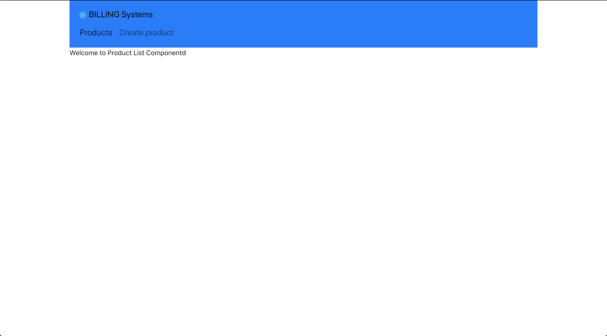
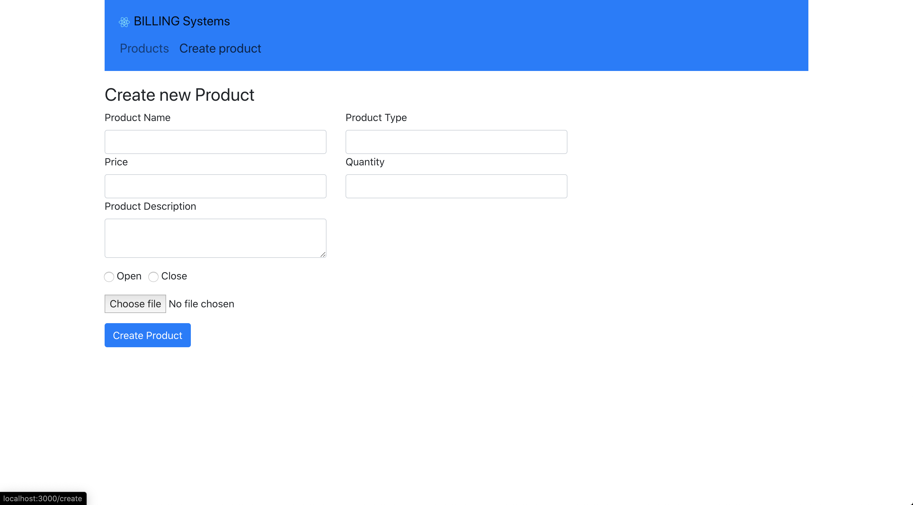

## Billing System App

### Setting Up The React Application

#### Check Node Version
```
node -v
```

#### Creating initial React Application

```
npx create-react-app billing-system
```

#### Start the Development Server

```
npm start 
```
#### Install Bootstrap 
```bash
npm install bootstrap
```

#### Adding the following line to App.js
```js
import "bootstrap/dist/css/bootstrap.min.css";
```
#### Install React Router

```bash 
npm install react-router-dom
```
#### Adding the routing configuration in App.js

```js
import { BrowserRouter as Router, Route, Link } from "react-router-dom";
```

#### Next, let's embed the JSX code in a `<Router></Router>` Element
```js
import React, { Component } from "react";
import { BrowserRouter as Router, Route, Link } from "react-router-dom";
import "bootstrap/dist/css/bootstrap.min.css";

class App extends Component {
  render() {
    return (
      <Router>
        <div className="container">
          <h2>Billing System</h2>
        </div>
      </Router>
    );
  }
}

export default App;
```
#### Inside the `<Router>` element we’re now ready to add the router configuration inside that element

```js
<Route path="/" exact component={ProductList} />
<Route path="/edit/:id" component={EditProduct} />
<Route path="/create" component={CreateProduct} />
```

> For each route which needs to be added to the application a new <Route> element is added
> The attributes path and component are used to add the configuration settings for each route
> By using the attribute path the routing path is set and by using the component attribute the path is connected with a component.

#### Routes

> Added three routes in our application
- /
- /create
- /edit/:id

#### Components
> For these three routes we want to connect to three components:
- ProductList
- EditProduct
- Create Product

#### Creating Components
> Let’s create a new directory src/components and create three new files:
- product-list.component.js
- edit-product.component.js
- create-product.component.js

#### Let’s add a basic React component implementation for each of those components:
> product-list.component.js:
``` js
import React, {Component} from "react"

export default class ProductList extends Component {
    render () {
        return (
            <div>
                <p>Welcome to Product List Componentd</p>
            </div>
        )
    }
}
```
> edit-product.component.js
```js
import React, {Component} from "react"

export default class EditProduct extends Component {
    render () {
        return(
            <div>
                <p>Welcome to Edit Product Components</p>
            </div>
        )
    }
}
```
> create-product.component.js
```js
import React, { Component } from 'react';

export default class CreateProduct extends Component {
    render() {
        return (
            <div>
                <p>Welcome to Create Product Component!!</p>
            </div>
        )
    }
}
```

#### Basic Layout & Navigation
```js
import React, { Component } from 'react';
import {BrowserRouter as Router, Route, Link} from "react-router-dom"
import "bootstrap/dist/css/bootstrap.min.css";

import CreateProduct from "./components/create-product.component";
import EditProduct from "./components/edit-product.component";
import ProductList from "./components/product-list.component";

import logo from "./logo.svg";

class App extends Component {
  render() {
    return (
      <Router>
        <div className="container">
          <nav className="navbar navbar-expand-lg navbar-light bg-primary">
            <a className="navbar-brand" href="www.google.com" target="_blank">
              
              <Link to="/" className="navbar-brand">BILLING Systems</Link>
              <div className="collpase nav-collapse">
                <ul className="navbar-nav mr-auto">
                  <li className="navbar-item">
                    <Link to="/" className="nav-link">Products</Link>
                  </li>
                  <li className="navbar-item">
                    <Link to="/create" className="nav-link">Create product</Link>
                  </li>
                </ul>
              </div>
            </a>
          </nav>
          <Route path="/" exact component={ProductList} />
          <Route path="/edit/:id" component={EditProduct} />
          <Route path="/create" component={CreateProduct} />
        </div>
      </Router>
    );
  }
}

export default App;
```

#### Let's check the Browser



### Create Product Component

#### Let’s add the CreateProduct component implementation in the next step in file create-product.component.js. First we start by adding a constructor to the component class:

```js
constructor(props) {
        super(props);

        this.state = {
            product_name: '',
            product_category: '',
            product_price: '',
            product_quantity: '',
            product_description: '',
            product_status: false,
            product_image: ''
        } 
    }
```

> Inside the constructor we’re setting the initial state of the component by assigned an object to this.state. The state comprises the following properties:
- product_name
- product_category
- product_price
- product_quantity
- product_description
- product_status
- product_image

#### Further more we need to add methods which can be used to update the state properties:

```js
onChangeProductName(e) {
        this.setState({
            product_name: e.target.value
        });
    }

    onChangeProductType(e) {
        this.setState({
            product_type: e.target.value
        });
    }
    onChangeProductPrice(e) {
        this.setState({
            product_price: e.target.value
        });
    }

    onChangeProductQuantity(e) {
        this.setState({
            product_quantity: e.target.value
        });
    }


    onChangeProductDescription(e) {
        this.setState({
            product_description: e.target.value
        });
    }

    onChangeProductStatus(e) {
        this.setState({
            product_status: e.target.value
        });
    }

    onChangeProductImage(e) {
        this.setState({
            product_image: e.target.value
        })
    }
```

#### Finally another method is needed to handle the submit event of the form which will be implemented to create a new product item:

```js
onSubmit(e) {
    e.preventDefault();

    console.log(`From Submit:`);
    console.log(`Todo Product Name: ${this.state.product_name}`);
    console.log(`Todo Product Price: ${this.state.product_price}`);

    this.setState({
        product_name: '',
        product_type: '',
        product_price: '',
        product_quantity: '',
        product_description: '',
        product_status: false,
        product_image: ''
    })

}
```

Inside this method we need to call e.preventDefault to ensure that the default HTML form submit behaviour is prevented. Because the back-end of our application is not implemented yet we’re only printing out what’s currently available in the local component’s state to the console. Finally we’re making sure that the form is resetted by setting the resetting the state object.

Because in the four implemented methods we’re dealing with the component’s state object we need to make sure to bind those methods to this by adding the following lines of code to the constructor:

```js
this.onChangeProductName = this.onChangeProductName.bind(this);
this.onChangeProductType = this.onChangeProductType.bind(this);
this.onChangeProductPrice = this.onChangeProductPrice.bind(this);
this.onChangeProductQuantity = this.onChangeProductQuantity.bind(this);
this.onChangeProductDescription = this.onChangeProductDescription.bind(this);
this.onChangeProductStatus = this.onChangeProductStatus.bind(this);
this.onChangeProductImage = this.onChangeProductImage.bind(this);
this.onSubmit = this.onSubmit.bind(this);
```

#### Finally we need to add the JSX code which is needed to display the form:

```js
render() {
    return (
        <div style={{marginTop: 20}}>
            <h3>Create new Product</h3>
            <form onSubmit={this.onSubmit} >
            <div className="row">
                <div className="col-4">
                <label>Product Name</label>
                <input type="text" 
                        className="form-control"
                        value={this.state.product_name}
                        onChange={this.onChangeProductName}
                        />
                </div>
                <div className="col-4">
                <label>Product Type</label>
                <input type="text"
                        className="form-control"
                        value={this.state.product_type}
                        onChange={this.onChangeProductType}
                        />
                </div>
            </div>
            <div className="row">
                <div className="col-4">
                <label>Price</label>
                <input type="text"
                        className="form-control"
                        value={this.state.product_price}
                        onChange={this.onChangeProductPrice}
                        />
                </div>
                <div className="col-4">
                <label>Quantity</label>
                <input type="text"
                        className="form-control"
                        value={this.state.product_quantity}
                        onChange={this.onChangeProductQuantity}
                        />
                </div>
            </div>
            <div className="row">
                <div className="col-4">
                    <label>Product Description</label>
                    <textarea name="description"
                            className="form-control"
                            value={this.state.product_description}
                            onChange={this.onChangeProductDescription}
                            />
                    {/* <input type="area"
                            className="form-control"
                            value={this.state.product_description}
                            onChange={this.onChangeProductDescription}
                            /> */}
                </div>
            </div>
                <div className="form-group mt-3">
                <div className="form-check form-check-inline">
                    <input className="form-check-input"
                            type="radio"
                            name="ProductOptions"
                            id="productOpen"
                            value="Open"
                            checked={this.state.product_status==='Open'}
                            onChange={this.onChangeProductStatus}
                            />
                    <label className="form-check-label">Open</label>
                </div>   
                <div className="form-check form-check-inline">
                    <input className="form-check-input"
                            type="radio"
                            name="ProductOptions"
                            id="productClose"
                            value="Close"
                            checked={this.state.product_status==='Close'}
                            onChange={this.onChangeProductStatus}
                            />
                    <label className="form-check-label">Close</label>
                </div>                             
                </div>
                <div className="form-group">
                    <input type="file"
                            name="image"
                            onChange={this.onChangeProductImage}
                            />

                </div>
                <div className="form-group">
                    <input type="submit" value="Create Product" className="btn btn-primary" />
                </div>
            </form>
        </div>
    )
}
```

### In the following you can see the complete source code which should now be available in create-product.component.js:

```js
import React, {Component} from "react"

export default class CreateProduct extends Component {

    constructor(props) {
        super(props);
        
        this.onChangeProductName = this.onChangeProductName.bind(this);
        this.onChangeProductType = this.onChangeProductType.bind(this);
        this.onChangeProductPrice = this.onChangeProductPrice.bind(this);
        this.onChangeProductQuantity = this.onChangeProductQuantity.bind(this);
        this.onChangeProductDescription = this.onChangeProductDescription.bind(this);
        this.onChangeProductStatus = this.onChangeProductStatus.bind(this);
        this.onChangeProductImage = this.onChangeProductImage.bind(this);
        this.onSubmit = this.onSubmit.bind(this);

        this.state = {
            product_name: '',
            product_category: '',
            product_price: '',
            product_quantity: '',
            product_description: '',
            product_status: false,
            product_image: ''
        } 
    }
    onChangeProductName(e) {
        this.setState({
            product_name: e.target.value
        });
    }

    onChangeProductType(e) {
        this.setState({
            product_type: e.target.value
        });
    }
    onChangeProductPrice(e) {
        this.setState({
            product_price: e.target.value
        });
    }

    onChangeProductQuantity(e) {
        this.setState({
            product_quantity: e.target.value
        });
    }


    onChangeProductDescription(e) {
        this.setState({
            product_description: e.target.value
        });
    }

    onChangeProductStatus(e) {
        this.setState({
            product_status: e.target.value
        });
    }

    onChangeProductImage(e) {
        this.setState({
            product_image: e.target.value
        })
    }

    onSubmit(e) {
        e.preventDefault();

        console.log(`From Submit:`);
        console.log(`Todo Product Name: ${this.state.product_name}`);
        console.log(`Todo Product Price: ${this.state.product_price}`);

        this.setState({
            product_name: '',
            product_type: '',
            product_price: '',
            product_quantity: '',
            product_description: '',
            product_status: false,
            product_image: ''
        })

    }
    render() {
        return (
            <div style={{marginTop: 20}}>
              <h3>Create new Product</h3>
              <form onSubmit={this.onSubmit} >
                <div className="row">
                  <div className="col-4">
                    <label>Product Name</label>
                    <input type="text" 
                           className="form-control"
                           value={this.state.product_name}
                           onChange={this.onChangeProductName}
                           />
                  </div>
                  <div className="col-4">
                    <label>Product Type</label>
                    <input type="text"
                           className="form-control"
                           value={this.state.product_type}
                           onChange={this.onChangeProductType}
                           />
                  </div>
                </div>
                <div className="row">
                  <div className="col-4">
                    <label>Price</label>
                    <input type="text"
                           className="form-control"
                           value={this.state.product_price}
                           onChange={this.onChangeProductPrice}
                           />
                  </div>
                  <div className="col-4">
                    <label>Quantity</label>
                    <input type="text"
                           className="form-control"
                           value={this.state.product_quantity}
                           onChange={this.onChangeProductQuantity}
                           />
                  </div>
                </div>
                <div className="row">
                  <div className="col-4">
                      <label>Product Description</label>
                      <textarea name="description"
                                className="form-control"
                                value={this.state.product_description}
                                onChange={this.onChangeProductDescription}
                                />
                      {/* <input type="area"
                             className="form-control"
                             value={this.state.product_description}
                             onChange={this.onChangeProductDescription}
                             /> */}
                  </div>
                </div>
                  <div className="form-group mt-3">
                    <div className="form-check form-check-inline">
                        <input className="form-check-input"
                               type="radio"
                               name="ProductOptions"
                               id="productOpen"
                               value="Open"
                               checked={this.state.product_status==='Open'}
                               onChange={this.onChangeProductStatus}
                               />
                        <label className="form-check-label">Open</label>
                    </div>   
                    <div className="form-check form-check-inline">
                        <input className="form-check-input"
                               type="radio"
                               name="ProductOptions"
                               id="productClose"
                               value="Close"
                               checked={this.state.product_status==='Close'}
                               onChange={this.onChangeProductStatus}
                               />
                        <label className="form-check-label">Close</label>
                    </div>                             
                  </div>
                  <div className="form-group">
                      <input type="file"
                             name="image"
                             onChange={this.onChangeProductImage}
                             />

                  </div>
                  <div className="form-group">
                      <input type="submit" value="Create Product" className="btn btn-primary" />
                  </div>
              </form>
            </div>
        )
    }
}
```



